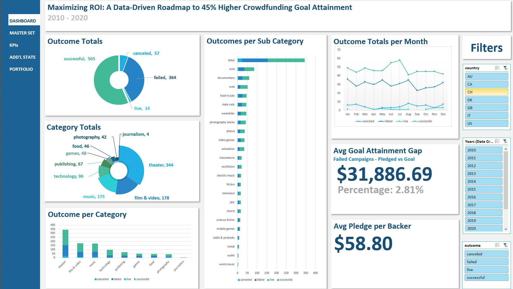
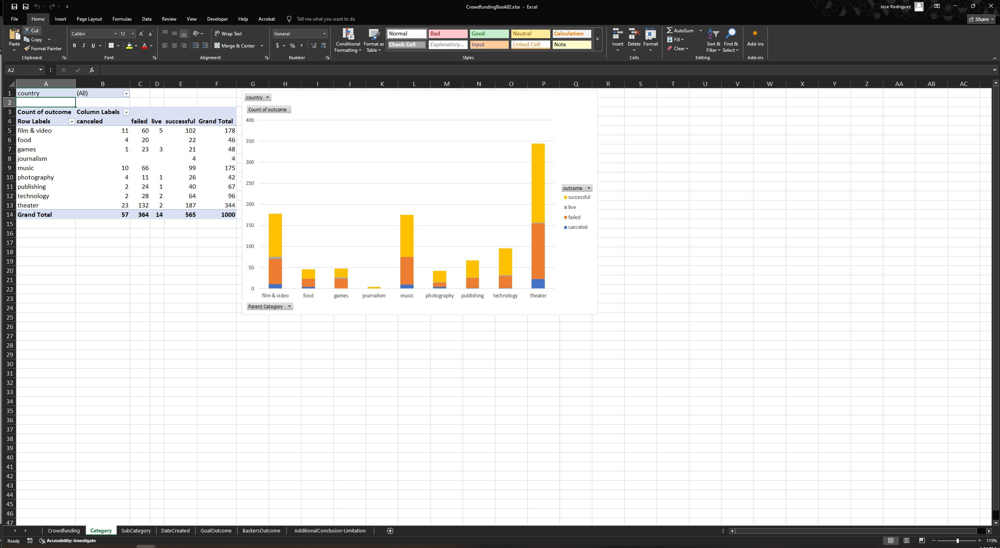

# Maximizing ROI: Predictive Trends for Optimal Launch Timing and Budgeting
**Background**

Crowdfunding platforms like Kickstarter and Indiegogo have been growing in success and popularity since the late 2000s. From independent content creators to famous celebrities, more and more people are using crowdfunding to launch new products and generate buzz, but not every project has found success.

To receive funding, the project must meet or exceed an initial goal, so many organizations dedicate considerable resources looking through old projects in an attempt to discover “the trick” to finding success. For this week's Challenge, you will organize and analyze a database of 1,000 sample projects to uncover any hidden trends.

This project evaluates core operational trends to resolve the following key inquiries:
- Given the provided data, what are three conclusions that we can draw about crowdfunding campaigns?
- What are some limitations of this dataset?
- What are some other possible tables and/or graphs that we could create, and what additional value would they provide?

 ## [Analysis with interactive dashboard (Excel File Download)](https://github.com/joeyrodriguez-analyst/13-Crowdfunding_ETL-Project_02/raw/main/00_Crowdfunding_Viz.xlsx)

## Extract, Tranform, & Load
Engineered custom metrics to track crowdfunding performance, calculating 'Percent-to-Goal' ratios across the entire dataset. Integrated dynamic conditional formatting to provide a high-level visual heat map of campaign success rates.

Metrics Added
- Percent Funded
- Average Donation
- Percent Category
- Percent Sub-Category

## Analysing the Categories and Sub-Categories
Constructed a multi-dimensional Pivot Table analysis to segment campaign outcomes—Success, Failure, Cancellation, and Live status—by category. This provided a high-level view of performance trends, enabling a comparative analysis of category-specific viability.

Constructed a similar Pivot Table analysis that allows for a more granular look at Sub-Categories with country-specific filters.

Developed a Time-Series Performance Dashboard to analyze campaign outcomes across fiscal periods. By engineering a pivot table to track outcome counts against creation dates, I established a baseline for historical trend analysis, allowing for a comparative view of success rates filtered by parent category and year

## Crowfunding Goal Analysis
Conducted a statistical distribution analysis to determine the correlation between funding targets and project success rates. Developed a structured matrix using complex COUNTIFS() logic to segment projects into 12 distinct goal brackets, ranging from <$1k to >$50k. Calculated localized success, failure, and cancellation probabilities to identify the 'sweet spot' for crowdfunding targets.

## Analysis Findings

### **Given the provided data, what are three conclusions that we can draw about crowdfunding campaigns?**
1. **The Timing (When to launch)**
  - **Finding:** January and July are the busiest months for new projects.
  - **Analyst Insight:** These months are "peak" times for the platform. This helps us plan when a new project will get the most eyes—or the most competition.

2. **The Budget (Finding the "Sweet Spot")**
   - **Finding:** Projects asking for more than $50,000 fail or get canceled much more often. Projects asking for $15,000 to $35,000 have the best track record.
   - **Analyst Insight:** There is a clear "success zone" for funding. To lower the risk of failure, it’s best to keep goals under $35k unless there is a massive following behind the project.

3. **The Top Categories (What’s popular)**
   - **Finding:** Theater, Film & Video, and Music are the clear leaders in total project volume.
   - **Analyst Insight:** These three categories dominate the platform. This shows where the community is most active and where the most historical data exists to help us predict results.

### **What are some limitations of this dataset?**
1. **Limited Granularity (The "Deep Dive" Problem)**
- **Finding:** Many categories don't have sub-categories, and there are no written descriptions for the campaigns.
- **Analyst Insight:** Without more detail, we can't tell why one project succeeded over another in the same group. We are missing the "story" behind the data.

2. **Geographic Bias (The "US-Centric" Problem)**
- **Finding:** 76% of the data comes from the US, while only 24% is split between six other countries.
- **Analyst Insight:** This dataset is heavily skewed toward American habits. The conclusions we draw might not be accurate for international markets.

3. **Financial Inconsistency (The "Standardization" Problem)**
- **Finding:** Different currencies haven't been converted to a single standard, and inflation isn't accounted for.
- **Analyst Insight:** A dollar today isn't the same as a dollar years ago, and different currencies have different values. Comparing them directly is like comparing "apples to oranges" and could lead to incorrect pricing strategies.

### **What are some other possible tables and/or graphs that we could create, and what additional value would they provide?**
1. **High-Level Outcome Distribution (Pie Chart)**
- **The Idea:** A pie chart showing the percentage of successful, failed, and canceled projects.
- **The Value:** This provides an immediate "Executive Snapshot" of the platform’s health. It allows stakeholders to see the overall success-to-failure ratio at a glance before diving into the more complex details. 

2. **Campaign Duration vs. Success Rate (Correlation Chart)**
- **The Idea:** A chart comparing how long a campaign ran (from start date to end date) against its final outcome. 
- **The Value:** This answers the question: "Is there a perfect length for a campaign?" By identifying if 30-day projects succeed more often than 60-day projects, we can give future creators a specific "optimal duration" to aim for. 

3. **Backer Engagement Analysis (New Suggestion)**
- **The Idea:** A bar chart showing the "Average Donation per Backer" across different categories. 
- **The Value:** This would help us understand "Audience Value." For example, do Music projects succeed because they have many small donors, or a few large donors? This helps in tailoring the marketing strategy for each category.
  
## Conclusion
This analysis successfully transformed raw crowdfunding data into a strategic roadmap for future campaign success by identifying key trends in timing, budgeting, and category performance. By leveraging advanced Excel functions and visualization techniques, I have pinpointed a "success sweet spot" for funding goals and identified peak launch windows, while also highlighting critical data limitations like geographic bias and lack of financial standardization. This work demonstrates my ability to provide executive-level insights and data-backed recommendations that can drive growth and minimize risk in complex market environments.

*Data for this dataset was generated by edX Boot Camps LLC, and is intended for educational purposes only.*
